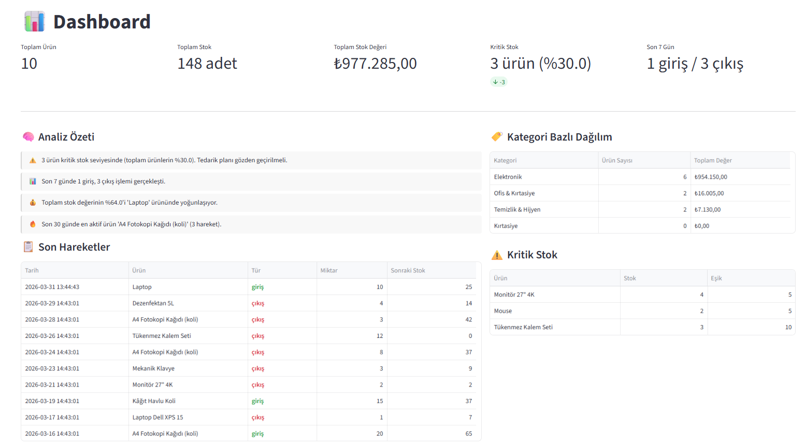
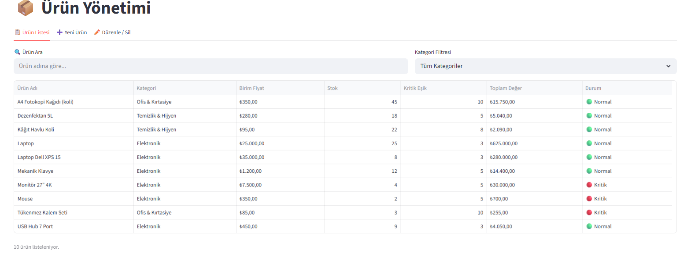
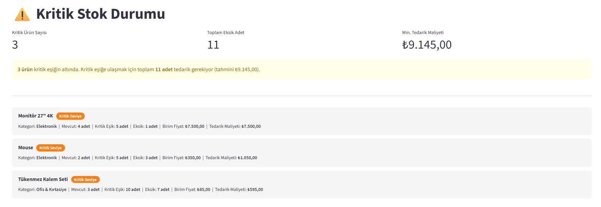
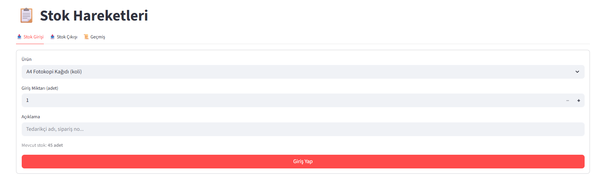

# 📦 Akıllı Stok Yönetim Sistemi

> Küçük ve orta ölçekli işletmelerin ürün envanterini, stok giriş-çıkışlarını ve kritik stok durumlarını takip edebileceği; Python OOP mimarisinde geliştirilmiş, SQLite destekli ve Streamlit tabanlı bir yönetim uygulaması.


---

## Problem ve Çözüm

**Problem:** Küçük işletmeler çoğunlukla stok takibini Excel ile yapar. Bu yaklaşım manuel hatalara, kritik stok durumlarının gecikmeli fark edilmesine ve geçmiş hareket analizinin zorlaşmasına yol açar.

**Çözüm:** Bu uygulama; ürün, kategori ve stok hareketi yönetimini tek bir arayüzde sunar. Kritik stok uyarıları otomatik tetiklenir, dashboard akıllı özetler üretir ve tüm veriler CSV olarak dışa aktarılabilir.

---

## Özellikler

| Modül | Özellikler |
|-------|-----------|
| **📊 Dashboard** | KPI kartları, analiz özeti, kategori dağılımı, son hareketler |
| **🏷️ Kategoriler** | Ekleme, silme, ürün sayısı gösterimi |
| **📦 Ürünler** | Ekleme, güncelleme, silme (onay adımlı), arama, filtreleme |
| **📋 Hareketler** | Stok giriş/çıkış, 5 boyutlu filtreleme, renk kodlu tür gösterimi |
| **⚠️ Kritik Stok** | Eksik adet, tedarik maliyeti, stok tükenme uyarısı |
| **📈 Raporlama** | 4 farklı CSV dışa aktarma, demo veri yükleme |

### İş Kuralları
- Stok çıkışı mevcut stoku aşamaz
- Fiyat, stok ve kritik eşik negatif olamaz
- Aynı isimli ürün tekrar eklenemez
- Ürün silme işlemi onay adımı gerektirir
- Kategoriye bağlı ürünler varken kategori silinemez
- Stok çıkışı kritik eşiği geçerse kullanıcı uyarılır

---

## Kullanılan Teknolojiler

| Teknoloji | Amaç |
|-----------|------|
| **Python 3.10+** | Temel dil |
| **Streamlit** | Web arayüzü |
| **SQLite** | Yerel veritabanı (kurulum gerektirmez) |
| **pandas** | Tablo işlemleri ve CSV dışa aktarma |
| **dataclasses** | OOP model katmanı |

---

## Proje Yapısı

```
stok_yonetim/
├── app.py           # Streamlit arayüzü — 6 sayfalı navigasyon
├── models.py        # OOP veri modelleri: Kategori, Urun, StokHareketi
├── database.py      # SQLite CRUD ve sorgu fonksiyonları
├── services.py      # İş kuralları ve doğrulama (StokServisi sınıfı)
├── requirements.txt
├── README.md
└── data/
    └── stok.db      # SQLite veritabanı (ilk çalıştırmada otomatik oluşur)
```

### Katmanlı Mimari

```
app.py  →  services.py  →  database.py  →  stok.db
  UI         İş Kuralları    CRUD           Veri
             + Doğrulama
             + Analiz
```

---

## Kurulum

```bash
# 1. Repoyu klonla
git clone https://github.com/turkensar/stok-yonetim.git
cd stok-yonetim

# 2. Sanal ortam oluştur
python -m venv venv

# Windows
venv\Scripts\activate

# macOS / Linux
source venv/bin/activate

# 3. Bağımlılıkları yükle
pip install -r requirements.txt

# 4. Uygulamayı başlat
streamlit run app.py
```

Tarayıcıda `http://localhost:8501` otomatik açılır.

---

## İlk Kullanım

Uygulama ilk açıldığında veritabanı otomatik oluşturulur. Hızlıca test etmek için:

1. **Raporlama → Demo Veri** sekmesine gidin
2. **"Demo Verisi Yükle"** butonuna tıklayın
3. 3 kategori, 8 ürün ve 15 stok hareketi otomatik yüklenir

---

## Ekran Görüntüleri

### Dashboard — KPI ve Analiz Özeti


### Ürün Yönetimi — Liste Görünümü


### Kritik Stok — Eksik Adet ve Maliyet


### Stok Hareketleri — Geçmiş Filtresi


---

## Gelecek Geliştirmeler

- [ ] Kullanıcı girişi ve rol bazlı yetkilendirme
- [ ] Ürün bazlı stok hareket grafiği (zaman serisi)
- [ ] E-posta ile otomatik kritik stok bildirimi
- [ ] Tedarikçi ve sipariş yönetimi modülü
- [ ] Barkod / QR okuma entegrasyonu
- [ ] Excel (.xlsx) dışa aktarma desteği

---

## Geliştirici

**Ensar Türk**
[LinkedIn](https://www.linkedin.com/in/ensar-türk-0501202a0) · [GitHub](https://github.com/turkensar)

---

> Bu proje portföy ve eğitim amaçlı geliştirilmiştir.
